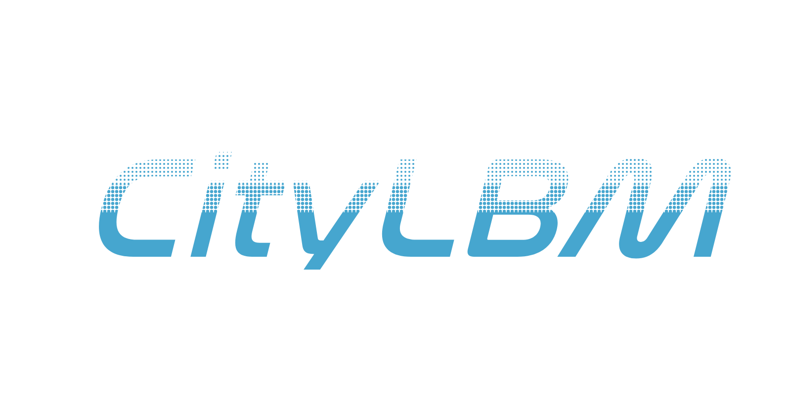
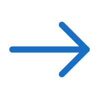
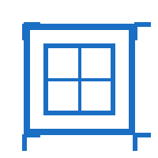
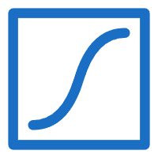
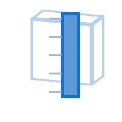
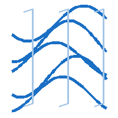

<p align="center">
  
</p>

<p align="center">
  
</p>

<p align="center">
  <strong>面向设计流程的城市风环境模拟工具</strong><br>
  <em>Design-oriented urban wind simulation workflow</em>
</p>

<p align="center">
  <a href="#中文">中文</a> | <a href="#english">English</a> | <a href="LICENSE">MIT License</a>
</p>

## 图标目录

CityLBM 的 README 主图标和组件图标集中如下。主图标的可编辑 Draw.io 源文件位于 [`assets/branding/citylbm-app-icon.drawio`](assets/branding/citylbm-app-icon.drawio)。下列图标是当前仓库随附的界面资源目录，不单独构成组件可用性或验证完成的声明。

| 场景与输入 | 仿真与数据 | 可视化与分析 | 工作流辅助 |
| --- | --- | --- | --- |
| <br>Create Scene | <br>Run Simulation | <br>Read VTK | <br>Validation |
| <br>Add Buildings | <br>Simulation Stats | <br>Velocity View | <br>Lawson |
| <br>Wind Condition | <br>Grid Generator | <br>VTK Cloud | <br>Data Probe |
| <br>Domain Setup | <br>Absolute Domain | <br>Slice View | <br>Streamlines |
| <br>Domain Designer | <br>Wind Speed Grid | <br>Vertical Slice | <br>Isosurface |
| <br>Scene Info |  |  |  |

---

<a id="中文"></a>
## 中文

CityLBM 是一个面向 Rhino/Grasshopper 设计流程的城市风环境模拟工作流。它连接场景定义、FluidX3D 案例生成与外部求解、VTK 结果读取和 Rhino 内可视化，使研究人员能够在同一参数化环境中组织可追溯的风环境案例。

### 当前可展示的成果

- **可运行的工作流原型**：从 Grasshopper 场景与建筑输入，到 FluidX3D 案例文件、VTK 输出和 Rhino 结果查看。
- **AIJ Case A/E 复现资产**：包含案例文件、`setup.cpp`、坐标/尺度元数据、点位结果表和工作流截图；v0.2.0 包用于复现与检查。
- **v0.3.0 验证就绪性改造**：风速与 `k` 剖面输入、元数据记录、时间平均、点位/归一化/几何尺度审计，以及原生 FluidX3D 基线预检和自动验证门禁。
- **可追溯实验链**：验证脚本与指标模板支持保存运行元数据、探针结果、哈希和门禁报告。

### 验证状态

项目处于积极开发阶段。现有 AIJ Case A/E 资产证明端到端工作流和诊断能力；其中短步数 smoke run 与诊断结果不应被解释为论文级精度验证。正式准确性结论仍需要严格原生基线、入口和边界条件证据、充分时间平均以及网格收敛记录。

### 快速开始

1. 按 [`INSTALL.md`](INSTALL.md) 将 `CityLBM.gha` 及其依赖安装到 Grasshopper Libraries 目录。
2. 在 Rhino/Grasshopper 中使用 `Create Scene` 和相关场景组件生成案例。
3. 使用 `Run Simulation` 指向完整的本地 FluidX3D 源码或可执行环境；仅生成案例可使用 `Mode 0`。
4. 使用 `Read VTK` 与可视化组件读取输出。严格 AIJ Case E 流程见 [`docs/CaseE_run_protocol.md`](docs/CaseE_run_protocol.md)。

### 构建

```powershell
dotnet build -c Release
```

Release 构建产物位于 `bin/Release/CityLBM.gha`。当前开发分支为验证就绪性迭代，不应替代经审核的正式发布包。

---

<a id="english"></a>
## English

CityLBM is an urban wind-simulation workflow for Rhino and Grasshopper. It connects scene definition, FluidX3D case generation and external execution, VTK result reading, and in-Rhino visualization so that wind-environment cases can be organized in one traceable parametric workflow.

### What Is Available

- **Runnable workflow prototype**: Grasshopper scene and building input through FluidX3D case files, VTK output, and Rhino result inspection.
- **AIJ Case A/E reproduction assets**: case files, `setup.cpp`, coordinate and scale metadata, probe-result workbooks, and workflow screenshots. The v0.2.0 package is intended for reproduction and inspection.
- **v0.3.0 validation-readiness work**: velocity and `k` profile input, metadata capture, time averaging, probe/normalization/geometry-scale audits, native FluidX3D baseline preflight, and automated validation gates.
- **Traceable experiment chain**: validation scripts and metric templates support run metadata, probe outputs, hashes, and gate reports.

### Validation Status

CityLBM is under active academic development. Existing AIJ Case A/E assets demonstrate the end-to-end workflow and diagnostic capability. Short smoke runs and diagnostic outputs are not publication-grade accuracy validation. Final accuracy claims require a strict native baseline, inlet and boundary evidence, adequate time averaging, and documented grid convergence.

### Quick Start

1. Follow [`INSTALL.md`](INSTALL.md) to install `CityLBM.gha` and its dependencies in the Grasshopper Libraries directory.
2. Create a case with `Create Scene` and the related scene components in Rhino/Grasshopper.
3. Point `Run Simulation` to a complete local FluidX3D source tree or executable environment. Use `Mode 0` for case generation only.
4. Read outputs with `Read VTK` and visualization components. See [`docs/CaseE_run_protocol.md`](docs/CaseE_run_protocol.md) for the strict AIJ Case E workflow.

### Build

```powershell
dotnet build -c Release
```

The Release artifact is written to `bin/Release/CityLBM.gha`. The current development branch focuses on validation readiness and is not a substitute for a reviewed release package.

## License

Released under the [MIT License](LICENSE).

## Author

Shiyu Miao, Dalian University of Technology<br>
miaoshiyu@mail.dlut.edu.cn
