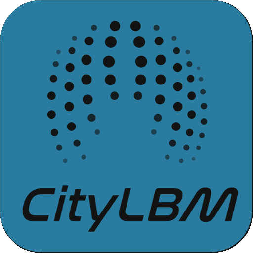

<table align="center">
  <tr>
    <td width="112" valign="middle">
      
    </td>
    <td valign="middle" align="center">
      <h1>CityLBM</h1>
      <strong>面向设计流程的城市风环境模拟工作流</strong> 
      <em>Design-oriented urban wind simulation workflow</em>
    </td>
  </tr>
</table>

  <a href="#中文介绍">中文</a> | <a href="#english-overview">English</a> | <a href="LICENSE">MIT License</a>

## 图标目录 / Icon Catalogue

主图标的可编辑 Draw.io 源文件位于 [`assets/branding/citylbm-app-icon.drawio`](assets/branding/citylbm-app-icon.drawio)。以下为仓库随附的界面图标目录；它们用于说明工作流界面，不单独构成组件可用性、求解器性能或验证完成的声明。

| 场景与输入 / Scene | 仿真与数据 / Simulation | 可视化 / Visualization | 分析与辅助 / Analysis |
| --- | --- | --- | --- |
|  Create Scene |  Run Simulation |  Read VTK |  Validation |
|  Add Buildings |  Simulation Stats |  Velocity View |  Lawson |
|  Wind Condition |  Grid Generator |  VTK Cloud |  Data Probe |
|  Domain Setup |  Absolute Domain |  Slice View |  Streamlines |
|  Domain Designer |  Wind Speed Grid |  Vertical Slice |  Isosurface |
|  Scene Info |  |  |  |

---

## 中文介绍

CityLBM 是面向 Rhino/Grasshopper 参数化设计流程的城市风环境模拟工作流。它将场景定义、建筑几何、FluidX3D 案例生成与外部求解、VTK 结果读取和 Rhino 内可视化串联起来，用于组织可追溯的城市风环境研究与设计探索。

### 可展示内容

- **设计工作流**：从 Grasshopper 场景与建筑输入，到 FluidX3D 案例文件、VTK 输出和 Rhino 结果查看。
- **案例资产**：仓库的 `releases/v0.2.0` 包含 AIJ Case A/E 的示例文件、`setup.cpp`、元数据、结果表和工作流截图。
- **验证工程化**：开发分支增加了速度与 `k` 剖面输入、运行元数据、时间平均、点位与归一化审计、原生 FluidX3D 基线预检和自动门禁。
- **可追溯性**：验证脚本和指标模板面向保存案例配置、探针结果、哈希及门禁报告。

### 版本进展对比

**v0.4.0 核心优势**：版本与安装包信息统一，完整连接全 AF 入口剖面、案例生成、原生求解、VTK 输出、官方测点后处理和自动审计；运行元数据、坐标/测点映射、入口与边界检查及门禁报告随包归档，便于在 GitHub 中复查、展示和延续验证工作。

| 版本 | 状态 | 相对前版的主要进展 | 适合展示的内容 | 版本定位 |
| --- | --- | --- | --- | --- |
| **v0.2.0** | 已发布的用户包 | 稳定的 Grasshopper 场景、案例生成和 VTK 可视化工作流；独立 `Lawson` 伴随组件；AIJ Case A/E 示例与校验文件 | 安装流程、界面图标、示例工作流、案例文件与复现步骤 | 面向用户安装、案例复现与工作流体验 |
| **v0.2.1** | 开发迭代 | 补充 AIJ Case A 工作流资料和辅助脚本，推进 FluidX3D 接入、VTK 可视化与界面图标整理 | 研究工作流演进、案例准备和组件界面 | 面向案例准备与组件能力扩展 |
| **v0.3.0** | 验证就绪开发分支 | 支持 `z, U, k` 自定义入口剖面、案例/坐标元数据、显式多帧时间平均、指标计算，以及入口、边界、探针、归一化和原生基线门禁 | 可追溯验证框架、协议、审计脚本与下一轮严格实验设计 | 面向严格验证实验的组织与审计 |
| **v0.4.0** | 验证工作流封装版 | 统一插件、Yak manifest 和程序集版本为 `0.4.0`；封装 Case A 全 AF 入口剖面、原生 FluidX3D 运行、VTK 完整性、坐标/探针、入口和边界审计链 | 完整的验证包、运行元数据、VTK 帧、官方测点后处理、门禁报告与可安装插件 | 面向 GitHub 分发、流程检查和持续验证研究 |

### 验证实验与已有模拟结果

| 验证实验 | 案例与设置 | 已有模拟结果 | 可展示证据 |
| --- | --- | --- | --- |
| **AIJ Case A 全 AF 入口剖面案例生成验证** | `AF_caseA.csv` 的 24 行 `z, U, k` 全表输入；CityLBM 生成 FluidX3D 案例 | 24 行入口数据已写入生成的 `setup.cpp` 与运行元数据 | `codegen_preflight_canary_manifest.json`、生成案例文件 |
| **AIJ Case A 原生 FluidX3D 300/150 模拟与测点后处理** | 西向来流；CityLBM 生成案例后由原生 FluidX3D 执行；`300` 步、每 `150` 步保存 | 求解器完成运行，输出 `u-000000150.vtk` 与 `u-000000300.vtk` 两帧；完成 186 个官方测点的后处理 | `native_fluidx3d_baseline_manifest.json`、`validation_metrics.csv`、`validation_gate_report.json` |
| **AIJ Case A VTK Save Start 保存调度验证** | 西向来流；`300 / 150 / 100`（总步数 / 保存间隔 / 保存起点） | 按计划输出 `u-000000100.vtk`、`u-000000250.vtk`、`u-000000300.vtk` 三帧完整 VTK | `native_short_canary_gate=pass` 与三帧 VTK 文件 |
| **AIJ Case A VTK 场回读与交互展示** | 已归档 `u-000001000.vtk` 与 `u-000002000.vtk`；中心线 90 点采样 | 已形成坐标映射、Excel 对比表和 7,378 个下采样三维速度样本，可用于 Three.js 交互预览 | [`docs/RESULTS_AND_VTK_GUIDE.md`](docs/RESULTS_AND_VTK_GUIDE.md)、[`docs/wind-field`](docs/wind-field) |

### 当前验证边界

AIJ Case A/E 的现有资产证明端到端工作流和诊断能力。短步数 smoke run、历史诊断结果或代码构建成功均不等同于论文级精度验证。正式准确性结论仍需要严格原生基线、入口和边界条件证据、充分时间平均、官方高度点位比对及网格收敛记录。

### 成果与 VTK 解读

AIJ Case A 的归档包包含 `u-000001000.vtk`、`u-000002000.vtk`、坐标映射、90 点采样脚本和既有对比表。文件结构、坐标换算、ParaView/Rhino 查看方式，以及速度单位与验证边界见 [`docs/RESULTS_AND_VTK_GUIDE.md`](docs/RESULTS_AND_VTK_GUIDE.md)。原始 VTK 体积较大，保留在本地验证档案而不直接纳入仓库。

### 交互风场预览

[`docs/wind-field`](docs/wind-field) 提供无需后端的 Three.js 浏览器预览：它加载由 Case A VTK 下采样生成的速度点与流向线段，可旋转查看三维风场。页面源码和生成脚本随仓库提交；启用静态站点托管后即可直接发布，原始 VTK 不会上传。

### 使用方式

1. 按 [`INSTALL.md`](INSTALL.md) 安装 `CityLBM.gha` 及依赖。
2. 在 Rhino/Grasshopper 中使用场景组件定义建筑、计算域和风况。
3. 生成 FluidX3D 案例，并在已配置的本地求解环境中运行。
4. 使用 `Read VTK` 与可视化组件读取结果；示例位于 [`releases/v0.2.0`](releases/v0.2.0)。

---

## English Overview

CityLBM is an urban wind-simulation workflow for Rhino and Grasshopper. It connects scene definition, building geometry, FluidX3D case generation and external execution, VTK result reading, and in-Rhino visualization for traceable urban wind research and design exploration.

### What This Repository Shows

- **Design workflow**: Grasshopper scene and building input through FluidX3D case files, VTK output, and Rhino result inspection.
- **Case assets**: `releases/v0.2.0` includes AIJ Case A/E examples, `setup.cpp`, metadata, result workbooks, and workflow screenshots.
- **Validation engineering**: the development branch adds velocity and `k` profile input, run metadata, time averaging, probe and normalization audits, native FluidX3D baseline preflight, and automated gates.
- **Traceability**: validation scripts and metric templates are intended to retain case configurations, probe outputs, hashes, and gate reports.

### Version Progress at a Glance

**v0.4.0 strengths**: unified release and installation metadata; a complete chain from full-AF inlet profiles through case generation, native execution, VTK output, official-probe post-processing, and automated audits; and packaged run metadata, coordinate/probe mappings, inlet/boundary checks, and gate reports for GitHub inspection and continued validation work.

| Version | Status | Main progress | Appropriate showcase | Release focus |
| --- | --- | --- | --- | --- |
| **v0.2.0** | Released user package | Stable Grasshopper scene, case-generation, and VTK-visualization workflow; separate Lawson companion; AIJ Case A/E examples and checks | Installation, icon system, example workflows, case assets, and reproduction steps | User installation, case reproduction, and workflow experience |
| **v0.2.1** | Development iteration | Added AIJ Case A workflow material and helper scripts; advanced FluidX3D integration, VTK visualization, and icon organization | Workflow evolution, case preparation, and component interface | Case preparation and component capability expansion |
| **v0.3.0** | Validation-readiness development branch | `z, U, k` inlet profiles, case/coordinate metadata, explicit multi-frame averaging, metrics, and inlet/boundary/probe/normalization/native-baseline gates | Traceable validation framework, protocol, audit scripts, and strict-experiment planning | Organization and audit of strict validation experiments |
| **v0.4.0** | Validation-workflow package | Unified plugin, Yak manifest, and assembly versions as `0.4.0`; packaged full-AF inlet profiles, native FluidX3D execution, VTK integrity, and coordinate/probe/inlet/boundary audit chains | Complete validation package, run metadata, VTK frames, official-probe post-processing, gate reports, and installable plugin | GitHub distribution, workflow inspection, and continuing validation research |

### Validation Experiments and Available Results

| Validation experiment | Case and setup | Available simulation result | Showcase evidence |
| --- | --- | --- | --- |
| **AIJ Case A full-AF inlet-profile case-generation check** | All 24 `z, U, k` rows from `AF_caseA.csv`; CityLBM-generated FluidX3D case | All inlet rows are emitted to the generated `setup.cpp` and run metadata | `codegen_preflight_canary_manifest.json` and generated case files |
| **AIJ Case A native FluidX3D 300/150 simulation and probe post-processing** | West wind; CityLBM-generated case executed by native FluidX3D; `300` steps with `150`-step saves | Completed solver run, with `u-000000150.vtk` and `u-000000300.vtk`; post-processing completed for 186 official probe rows | `native_fluidx3d_baseline_manifest.json`, `validation_metrics.csv`, and `validation_gate_report.json` |
| **AIJ Case A VTK Save Start scheduling verification** | West wind; `300 / 150 / 100` for total steps, save interval, and save start | Planned complete VTK frames at `u-000000100.vtk`, `u-000000250.vtk`, and `u-000000300.vtk` | `native_short_canary_gate=pass` and the three VTK files |
| **AIJ Case A VTK field readback and interactive preview** | Archived `u-000001000.vtk` and `u-000002000.vtk`; 90 centre-line probe samples | Coordinate mapping, comparison workbook, and 7,378 downsampled 3D velocity samples for the Three.js preview | [`docs/RESULTS_AND_VTK_GUIDE.md`](docs/RESULTS_AND_VTK_GUIDE.md) and [`docs/wind-field`](docs/wind-field) |

### Validation Boundary

Existing AIJ Case A/E assets demonstrate the end-to-end workflow and diagnostic capability. Short smoke runs, historic diagnostic outputs, or a successful code build are not publication-grade accuracy validation. Final accuracy claims require a strict native baseline, inlet and boundary evidence, adequate time averaging, official-height probe comparison, and documented grid convergence.

### Results and VTK Guide

The archived AIJ Case A package contains `u-000001000.vtk`, `u-000002000.vtk`, coordinate mapping, a 90-point sampling script, and an existing comparison workbook. See [`docs/RESULTS_AND_VTK_GUIDE.md`](docs/RESULTS_AND_VTK_GUIDE.md) for file structure, coordinate conversion, ParaView/Rhino inspection, velocity-unit limits, and validation boundaries. The raw VTK snapshots remain in the local validation archive because of their size.

### Interactive Wind-Field Preview

[`docs/wind-field`](docs/wind-field) contains a backend-free Three.js preview. It loads downsampled Case A velocity points and flow-direction segments for an orbitable 3D view. The page source and generation script are versioned with the repository; it is ready for static hosting without publishing the raw VTK.

### Usage

1. Follow [`INSTALL.md`](INSTALL.md) to install `CityLBM.gha` and dependencies.
2. Define buildings, the computational domain, and wind conditions with the Rhino/Grasshopper scene components.
3. Generate a FluidX3D case and run it in a configured local solver environment.
4. Read results with `Read VTK` and visualization components; examples are under [`releases/v0.2.0`](releases/v0.2.0).

## License

Released under the [MIT License](LICENSE).

## Author

Shiyu Miao, Dalian University of Technology 
miaoshiyu@mail.dlut.edu.cn
